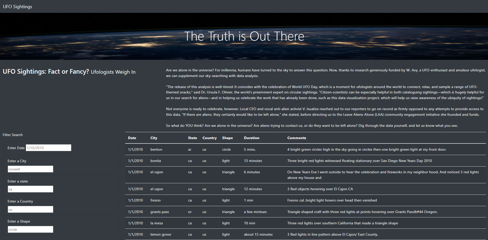
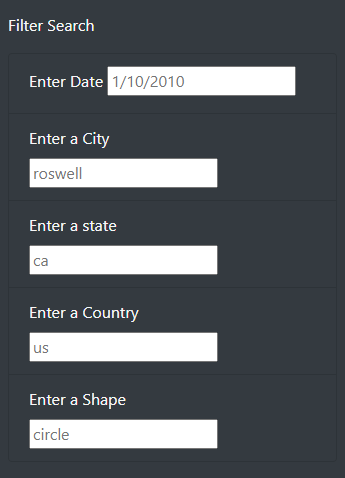
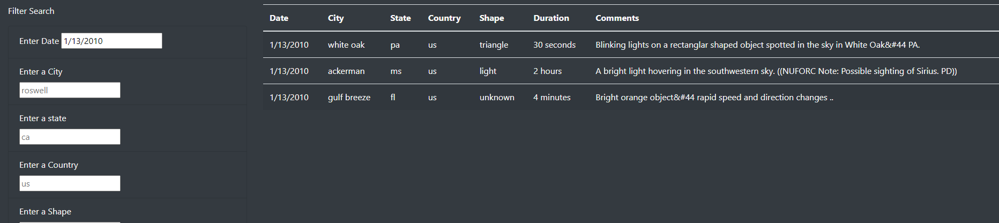
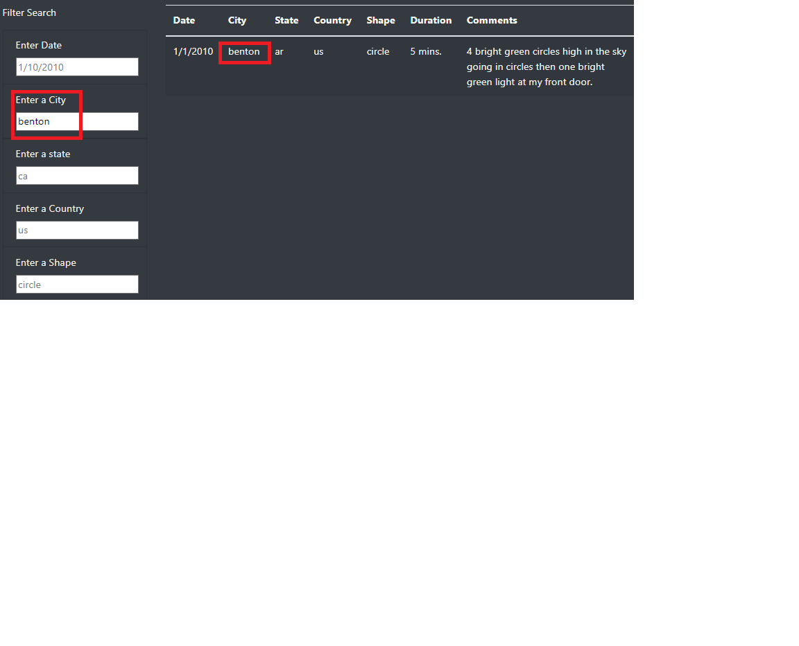
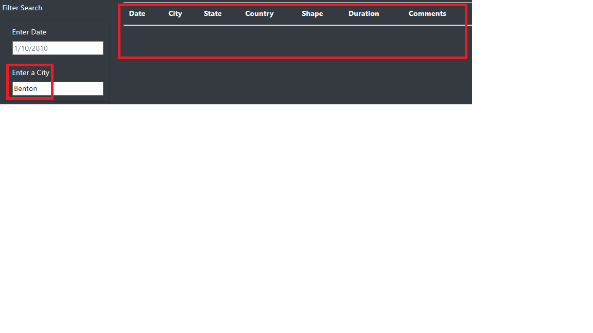

# UFOs

## Overview of Project:
Dana is a data journalist covering a topic on UFOs. For this assignment, Dana has a javascript file filled with sighting information. Using javascript, we can filter and sift through the necessary data. Additionally, the article will be posted online using a tidy html page including her article, table of data and easy-to-use filters to fine tune the results.

### Resources:
- Data source: data.js
- Software: [VS Code](https://code.visualstudio.com/), Internet Browser ie. Google Chrome

## Results: How-to Use
Upon opening the site, visitors will be greeted by this page:

On the left-hand side of the page, visitors will be able to filter using one or multiple criterias shown below:

Upon entering values into the criteria field, the table updates accordingly:

## Summary:

### Drawback:
The user must know specific information to use the filters. For example, the "shapes" criteria might not be intuitive as 'light' is one of the options for that column:

Also, the filters are case sensitive, which means that the information that values we enter in the search filters will not return if it does not match the formatting from our data source:

### Recommendations:
1. The city filter should be more flexible to allow the filter of cities regardless of case sensitivity.

2. A date range should be used instead of a specific date. Due to the infrequency of sightings, the user may have a difficult time searching for sighting information based on date alone. 